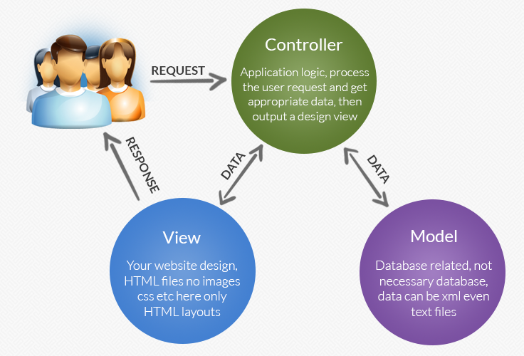

PHP
====
* Front-end js css/html ce que l'utlisateur voit  
* back-end php surtt pr back-end  
* utiliser fonctions compatibles au minimum php 5 et 7  
* "" permet d'utiliser les caractères d'échappement  

Php avantages
-----
 * permet de modifier par exemple le txt en fonction de la langue utilisateur en ajoutant conditions et en utilisant par exemple google translate.    
 * fonctionne partout car c'est le serveur qui le génère il suffit donc que le serveur le gère pour qu'il fonctionne chez l'utilisateur.     
 * N'utilise pas les ressources de l'appareil utilisateur car calcul côté serveur.    

MySQL
-----
 * Tableau à plusieurs dimensions avec une persistence. On va pouvoir à tout moment modifier ou retirer des données de ce tableau. 
 * Fichier MySQL est un très gros fichier texte.
 * attention à ce que l'utilisateur ne camoufle pas du php dans ce que l'on récupère  
 * php appelle le MySQL. 

rq:
en php on ne crée plus des fonctions comme en js mais des objets, on aura pas besoin d'attendre la fin de la fonction pour passer acceder aux autres instructions
  
Mvc
---
model(données(contenues dans MySQL)) view(html/css) controller(functions)

methodes get et post
-----
get passe les paramètres dans l url  

Ecrire une page en php
----
	<?php $name="moi" ?>
la varable name sera détruite après son interprétation
	$pwd="cool"
sera comparé mais ne sera pas stocké!
	

Equivalent innerHtml
	<?php echo"Bonjour"
 ?>

. pour concaténation + pour calculs

	<?php 
		$nom=" ".$_GET["nom"];
		echo "bonjour".$nom;
	 ?>

	<?php 
		$nom=" ".$_POST["nom"];
		echo "bonjour".$nom;
	 ?>

	 	<?php 
		$nom=" ".$_SESSION["nom"];
		echo "bonjour".$nom;
	 ?>

		 <?php 
		if(isset($_GET["page"])){	
		$nom=$_GET["page"];
	}else{$nom='accueil';
	}
	 ?>

	<!DOCTYPE html>
	<html>
	<head>
		<title><?php 
					$nom 
				?>
		</title>
	</head>
	<body>
	<h1><?php 
	for($i=0; $i<3; $i++){
			echo '<h1>'.$nom."</h1>"; 

	}
	?>
	</body>
	</html>

hors lampp php peut être utilisé en ligne de commande uniquement

	include 'page.php';
à éviter (include page externe possible dans url)
	include $nom'.php';
	utiliser ./ pour les document.location.href=  
 * faire toutes les vérifications dans la partie contrôle php avant le doctype cad ttes les créations de fichier tkt et les isset GET...

Création fichier texte
===
code lettre écriture/lecture...   
---
* r   
 * curseur au début  
 * lecture  
* w   
 * reset   
 * curseur au début   
 * créé fichier si n'existe pas  
 * écriture seule  
* a  
 * curseur à la fin   
 * écriture seule  
 * créé si n'existe pas  
* x   
 * crée ouvre  
 * écriture seule  
 * si fichier existe déjà false(suppr si existe déjà)  
* c  
 * pointeur début  
 * écriture seule  
 * non tronqué  

Exemple code
----
	<?php
		$fichier= fopen('fichier.txt, 'a');//crée fichier si existe pas sinon l'ouvre
		fputs($fichier, "texte à ajouter\n");//écrit à la fin du fichier txt tjrs doubles guillemets dans fputs
		file_get_content
                fclose($fichier);
                
	<?
forcer une variable à être un entier
----
	$string="vive les for";  
	$integer=(integer)$string;  
	var_dump($integer);  
définir une cst
---
	define ('nom', 'valeur');
Superglobales
----

var_dump($_GLOBALS) ou $_GET ou POST ou FILES ou COOKIE ou SESSION ou ENV

elseif
---
pas d'espace contrairement au javascript  
tableau associatif
---
	$array=array("a"=>"pommes", "b"=>"oranges");
ici clef = a b et nn 0 et 1
on ne peux pas utiliser de clef de type float
tri tableau
---
* sort() tri alpha réécrit(remodifie les clefs)
* rsort() alpha inverse
* asort() tri sans réécrire les clefs
* arsort() idem ordre inverse
* ksort()tri les clef par ordre alphabétique
* krsort() idem reverse
notion de jointure/liaison
---
sauvegarder un tableau
---
transformer tableau en chaine de caractere
--
	$str= serialisze($array)  
	$strenc=urlencode($str)//encode la chaine de caractere pour qu'elle puisse être enregistrée et envoyée  
	rd $arr = unserialze(urldecode($strenc));// fait l'opération inverse  
afficher les erreurs en local  
--
ini_set('display_errors', 1); erreurs affichées à l'écran mettre à 0 pr desactiver  
init_set('log_errors',1);// les écrit dans in fichier  
ini_set('error_log, dirname(__file__) .'/  
log_error_php.txt');   

fonctionnaire
====
chaine caractères
----

		strlen($monString) 

 * donne la longeur du string

		substr($monString, -1)

 * récupère dernier caractère d'une chaine

		$rest = substr("abcdef", -1);    // retourne "f"
		$rest = substr("abcdef", -2);    // retourne "ef"
		$rest = substr("abcdef", -3, 1); // retourne "d"

		mixed strpos ( string $haystack , mixed $needle [, int $offset = 0 ] )

 * Cherche la position numérique de la première occurrence de needle dans la chaîne de caractères haystack. 
 * Retourne la position numérique de l'occurrence relativement au début de la chaîne haystack (indépendamment de l'offset). Notez également   que la position dans la chaîne commence à 0, et non pas à 1. 
	
		string strpbrk ( string $haystack , string $char_list )
 * strpbrk() recherche l'ensemble de caractères char_list dans la chaîne haystack. 
array
----
* transformer .txt en array et l'afficher en allant à la ligne grâce <pre>

		$string = file_get_contents("dictionnaire.txt", FILE_USE_INCLUDE_PATH);
		$dico = explode("\n", $string);
		echo'<pre>';
		var_dump($dico);

